  <picture>
    <source media="(prefers-color-scheme: dark)" srcset="./dark-original.svg" />
    <source media="(prefers-color-scheme: light)" srcset="./light-original.svg" />
    
  </picture>

<h1 align="center">Hi 👋, I'm Zahid Hussain</h1>

<h3 align="center">
  Full Stack Engineer | MERN Stack Developer | React.js • Next.js • Node.js • FastAPI
</h3>

  

  

---

## About Me

- Full-Stack Engineer with hands-on experience building scalable web applications.
- Based in Lahore, Pakistan.
- Studied at PUCIT.
- Focused on SaaS platforms, FinTech products, AI products, and clean architecture.
- I enjoy turning ideas into production-ready software.

---

## 🏆 Achievements

- 🏅 4+ Years of Professional Experience
- 🏅 Built Production-Level FinTech Platforms
- 🏅 Developed AI-Powered Web Applications
- 🏅 Led Teams and Delivered Enterprise Solutions
- 🏅 Built Multiple SaaS Products

---

## Tech Stack

### Frontend

  

### Backend

  

### Database

  

### Tools & Cloud

  

---

## Experience

### MERN Stack Developer | Techbucks
**Jun 2023 - Present**

- Leading development of modern web applications.
- Building scalable frontend and backend systems.
- Integrating Python FastAPI services.
- Managing production deployments.

### Web Developer | Codesuite
**Jun 2022 - May 2023**

- Developed React.js and Next.js applications.
- Built API integrations and frontend architecture.
- Worked closely with backend teams.

### Software Developer | Weltfern
**Sep 2021 - May 2022**

- Developed responsive React applications.
- Built reusable UI components.
- Managed deployments and bug fixes.

---

## Featured Projects

### LieDetection.io

AI-powered lie detection platform with:

- Facial expression analysis
- Voice stress detection
- Behavioral pattern recognition
- Real-time emotion scoring

**Stack:** Next.js • FastAPI • TensorFlow • OpenCV

### Facto ERP

Enterprise SaaS ERP solution with:

- Warehouse management
- Production management
- Task scheduling
- Product deliveries
- Supplier management
- Customer management

**Stack:** React.js • Django • Tailwind CSS

---

## GitHub Stats

  

  
  

<!-- Replace `YOUR-INSTANCE.vercel.app` with your self-hosted `github-readme-stats` URL. -->

---

## Contribution Snake

  <picture>
    <source media="(prefers-color-scheme: dark)" srcset="https://raw.githubusercontent.com/zahid-hussain-dev/zahid-hussain-dev/output/github-snake-dark.svg" />
    <source media="(prefers-color-scheme: light)" srcset="https://raw.githubusercontent.com/zahid-hussain-dev/zahid-hussain-dev/output/github-snake.svg" />
    
  </picture>

This will appear after the first successful GitHub Action run creates the `output` branch.

---

## Connect With Me

  
  &nbsp;&nbsp;
  

---

## 🎯 Current Focus

- 🚀 Building scalable SaaS applications
- 🤖 AI & Automation Solutions
- 💰 FinTech Products
- ⚡ Next.js & FastAPI Architecture
- ☁️ Cloud Deployments

---

<!-- ## Setup Checklist

- Keep `dark-original.svg`, `light-original.svg`, and `.github/workflows/snake.yml` in the repo so the banner and snake blocks render correctly.
- Enable GitHub Actions workflow permissions with read and write access so the snake workflow can publish to the `output` branch.
- Deploy your own self-hosted `github-readme-stats` instance and replace `YOUR-INSTANCE.vercel.app`. -->

  <b>First, solve the problem. Then, write the code.</b>

